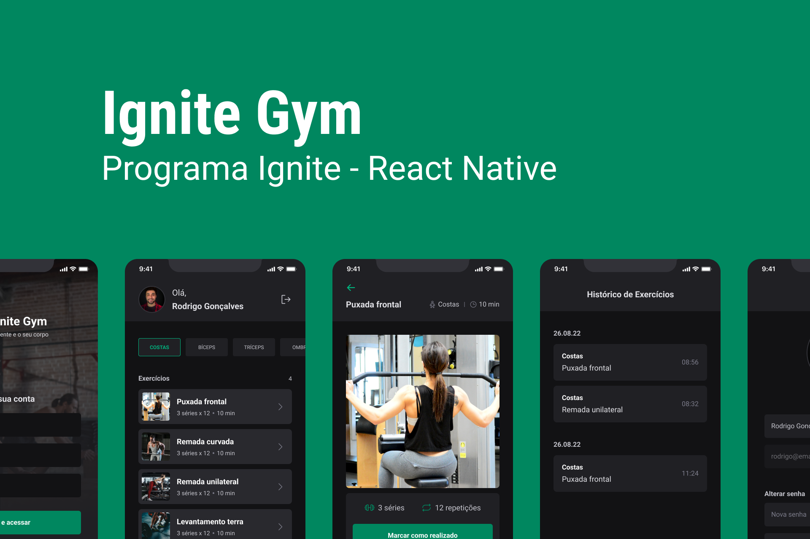

# Ignite GYM



<br />

## About the project

This project serves to help you do the exercises correctly and you have the history of which exercise was performed.

---

## :rocket: Technologies

This project was developed with the following technologies:

- Mobile

  - [x] [React Native](https://reactnative.dev)
  - [x] [Expo](https://expo.dev)
  - [x] [NativeBase](https://nativebase.io/)

## :gear: Execute

First clone this repository:

```bash
$ git clone https://github.com/Gustavohsdp/gym
$ cd gym
$ git clone  https://github.com/Gustavohsdp/gym-api
$ cd gym-api
```

### Server

```bash
$ cd gym-api
$ npm i
$ npm run migrate
$ npm run dev
```

### Mobile

```bash
$ cd gym
$ npm i
$ npx expo start
```

## :memo: License

This project is under the [MIT license](./LICENSE).
